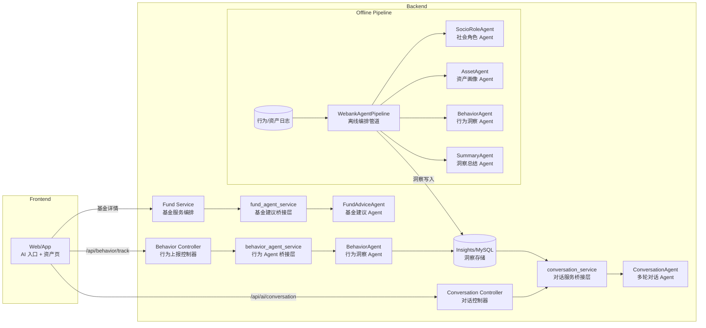

# WeMate（金服智能陪伴体 / 微伴）

> 该项目为微众银行“智能代理”赛事参赛作品，代码以实际实现为准，并结合 PRD 描述产品愿景。我们希望把 AI 陪伴体嵌入合作方金融 App，为用户提供 7x24 小时有温度的投资陪伴体验。

---

## 1. 产品概述

### 背景与愿景
- **散户困境**：85% 的散户在牛市也难以跑赢大盘，情绪化交易是主要原因。
- **陪伴缺位**：70% 以上的理财用户在市场波动时希望获得即时指导，但传统投顾只覆盖高净值人群。
- **愿景**：WeMate 成为用户全生命周期的智能陪伴体，提供“全周期 24 小时陪伴 + 意图驱动精准推荐 + 结构化画像千人千面”。

### 产品目标
1. **波动期安抚**：市场剧烈震荡时主动干预，降低客户流失，增强信任。
2. **提升 AUM**：通过个性化推荐与持续教育，引导用户优化资产配置，提升 AUM。
3. **B2B2C 赋能**：先服务区域性银行、中型券商、保险/养老机构，帮助其 App 快速具备智能陪伴能力。

---

## 2. 核心能力（PRD & 实际实现对照）

| 能力 | 实际落地 | PRD 价值 |
| --- | --- | --- |
| **情感化陪伴体** | 企鹅助手（悬浮按钮、AI 气泡、聊天面板、语音播报）。 | 解决“工具冰冷”，提供情绪陪伴。 |
| **动态画像引擎** | MySQL 扩展用户/持仓/账单表，`agents/` 下 SocioRole/Asset/Behavior/ Summary Agents 生成结构化洞察。 | 实现“知根知底”的画像与意图识别。 |
| **意图识别与干预** | `BehaviorTracker` + `/api/behavior/track` + `services/behavior_agent_service`。按阈值触发高亮/弹窗，示例：恐慌安抚、一键定投。 | 在关节点准确干预，降低恐慌赎回。 |
| **个性化内容生成** | Conversation Agent（DashScope）结合本地资产/账单/资讯上下文；若模型不可用则 fallback 到本地逻辑仍输出结构化建议。 | 让每个用户感知“千人千面”的温暖建议。 |
| **资讯与教育** | `scripts/seed_news.py` 写入新闻样本，`NewsPage/NewsDetail` 展示。`local_adapter` 会在对话中引用资讯摘要。 | 满足“教育与体验市场”“资产配置建议”场景。 |
| **资产全景** | AssetPage 展示持仓、配置比例、风险等级；AI 资产分析提供操作建议。 | 帮助用户了解资产结构，支持稳健/进取策略。 |

---

## 3. 场景示例（PRD 用户故事）

| 场景 | PRD 描述 | 代码亮点 |
| --- | --- | --- |
| **市场暴跌日安抚** | 识别恐慌 → 温暖话术 + 数据支撑 + 一键定投。 | `controllers/behavior_controller`、`services/behavior_agent_service`、`hooks/useAI`。 |
| **个性化匹配与排雷** | 根据风险等级给出优选列表并提示风险。 | `services/fund_service` + `FundList` 高亮 + AI Chat 动作按钮。 |
| **资产诊断与调仓** | 定期推送资产概览，结合行为推荐下一步操作。 | `AssetPage`、`services/asset_service`、`local_adapter`。 |
| **资讯陪伴** | 当用户询问“今日新闻/金融资讯”时，提供本地新闻摘要，并引导查看详情。 | `local_adapter._load_recent_news` + `NewsPage`。 |

---

## 4. 技术架构

### 4.1 后端（Flask）
- `app.py`：注册 API 与静态资源。
- `controllers/`：基金/账单/资讯/行为/AI 路由。
- `services/`：业务编排（AI 建议、基金分析、资产 AI 分析、会话）。
- `mapper/`：MySQL 映射（含新增 `UserPositions`、`News` 等）。
- **Conversation Service**：调用 Agno Conversation Agent；若 DashScope/DB 不可用，则自动切换到本地上下文。

### 4.2 Agno Agents
- `agents/socio_role`：社会角色解析。
- `agents/asset`：资产等级、风险承受能力、信用能力。
- `agents/behavior`：行为日志 → 意图标签、活跃度、干预信号。
- `agents/summary`：综合输出话术、Next Best Actions、风险提示。
- `agents/conversation`：多轮对话中台（记忆、洞察检索、持久化），提供 `/api/ai/conversation`。

### 4.3 前端（React + Vite）
- `src/App.jsx`：整合 Home/资产/理财/资讯/AI 助手。
- `components/AIAssistant` & `components/ai/AIChat`：浮窗、气泡、语音播报。
- `components/AssetPage`、`FundList`：资产配置、基金定位与高亮。
- `components/NewsPage/NewsDetail`：资讯列表与轮播。
- `hooks/useAI` + `utils/BehaviorTracker`：统一管理建议展示、语音开关、行为上报。

### 4.4 多 Agent 协作架构

WeMate 的智能体验由多 Agent 协同驱动：实时在线链路负责对话、基金解读与行为提醒，离线管道沉淀结构化洞察供前者复用。核心思路是 **专职 Agent + 轻量桥接层**，既保持模型独立调参，也方便在 Flask 服务内热更新。



- **ConversationAgent**（`agents/conversation`）  
  - *定位*：面向用户的多轮理财助手，所有 `/api/ai/conversation` 请求都经过 `services/conversation_service`，再转调远端 Agent。  
  - *设计理念*：拉取 `fetch_user_insights()` 的画像、`memory` 中的历史消息构造 prompt；通过 `_strip_code_blocks` 防止 Markdown/JSON 注入；若远端模型不可用则降级到 `local_adapter` 生成确定性回复，保障对话不中断。

- **BehaviorAgent**（`agents/behavior`）  
  - *定位*：分析 BehaviorTracker 上报的埋点日志，产出运营级语句/NBA（Next Best Action），既在离线管道运行，也能被 `services/behavior_agent_service.generate_behavior_analysis` 实时调用。  
  - *设计理念*：统一 prompt builder 和 `trace_agent_span` 埋点方便观测；输出由 `_coerce_to_dict` 兜底成 JSON，Bubble/通知无需复杂解析。

- **FundAdviceAgent**（`agents/fund_advice`）  
  - *定位*：在基金详情页生成个性化解读与风险提示。  
  - *设计理念*：`services/fund_agent_service` 引入 300s LRU 缓存与签名函数，避免重复走大模型；失败时自动回落 `_fallback_fund_suggestion`，确保接口稳定。

- **SocioRoleAgent / AssetAgent / SummaryAgent**（`agents/socio_role`, `asset`, `summary`）  
  - *定位*：离线批处理链路的前三/终节点，依次完成社会角色打标、资产能力分层、跨源结果综述。  
  - *设计理念*：由 `WebankAgentPipeline` 串联顺序执行，通过 `_annotate_agent_*` 将输入输出写入 Telemetry，方便和行内风控/监管系统对接；产物最终由 `/api/ai/insights/refresh` 写入 `insight_repository`，供对话与推荐 Agent 复用。

借由上述拆分，WeMate 可以在不影响其它链路的情况下独立升级任一 Agent（更换模型、调提示词或加入观测），并通过统一洞察仓实现“离线沉淀 + 在线实时”的双速节奏。

---

## 5. 快速开始

### 5.1 环境
- Python 3.8+、Node.js 16+、MySQL 5.7+。
- 建议 `python -m venv .venv && source .venv/bin/activate`。

### 5.2 安装依赖
```bash
pip install -r requirements.txt
cd src && npm install
```

### 5.3 配置 `.env`
`cp .env.example .env`，根据实际填写：
- MySQL：`DB_HOST/DB_PORT/DB_USER/DB_PASSWORD/DB_NAME`。
- DashScope（可选）：`DASHSCOPE_API_KEY`、`DASHSCOPE_BASE_URL`、`AGNO_MODEL_ID`、`AGNO_TEMPERATURE`。
- 行为/会话：`AI_MEMORY_BACKEND=memory` 可在无 DB 时走内存模式。
- LangSmith、OpenTelemetry 相关变量按需填写。

### 5.4 初始化数据
```bash
python init_db_migration.py
python init_user_profile_extension.py
python init_user_positions.py
python scripts/seed_news.py
```

### 5.5 启动
```bash
# 后端
python app.py

# 前端
cd src && npm run dev
```

---

## 6. 目录结构

```
Fin-ai/
├── app.py        # Flask 入口
├── controllers/  # 业务路由
├── services/     # 业务编排 + AI 调用
├── mapper/       # MySQL 映射
├── agents/       # Agno Agents 与 Conversation 中台
├── scripts/      # 初始化脚本（seed_news 等）
├── src/          # React 前端
├── tests/        # 单元测试
└── README.md
```

---

## 7. 与 PRD 的对齐

| PRD 模块 | README & 代码对应 |
| --- | --- |
| 情感化陪伴体 | 企鹅助手 + AI 气泡 + 行为触发 + 语音播报。 |
| 动态画像引擎 | 多数据表 + Agents/Pipeline，实现社会/资产/行为洞察。 |
| 意图识别与干预 | 行为日志上报 + Agent 分析 + 高亮/弹窗/NBA（Next Best Action）。 |
| 个性化内容生成 | Conversation Agent + 本地上下文（资产、账单、资讯），结合 fallback。 |
| 场景 1/2 | 通过行为触发、基金高亮、市场资讯在 UI 中落地。 |
| 技术架构 | Agno Workflow + Flask API + React 前端 + 行为上报。 |

---

## 8. 后续规划

1. **指标化运营**：埋点建议采纳率、定投转化率、NPS 等，量化 AI 陪伴效果。
2. **模型多样性**：在保障隐私的前提下增加本地 LLM 或多模型策略。
3. **B2B2C 接入**：提供 SDK/Widget，与合作方 App 快速集成。
4. **情绪细粒度识别**：扩展行为意图标签，强化“恐慌安抚”“资产调仓”等场景。

---

> WeMate 旨在让金融 App 不再是“冰冷工具”，而是一位懂你、能陪伴的智能伙伴。欢迎评审与合作伙伴在本仓库基础上继续迭代，也期待您的反馈与建议。💡
